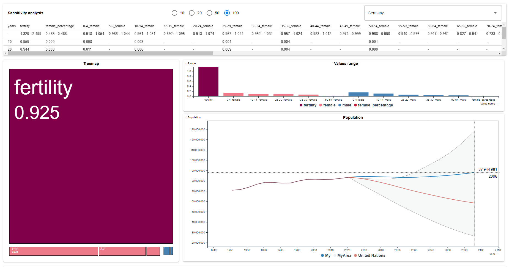

### Description

In this work, it was necessary to make a [variance-based sensitivity analysis](https://en.wikipedia.org/wiki/Variance-based_sensitivity_analysis) based on a [previously created predictive model](https://github.com/IngeniariusSoftware/demographic-model). The project is divided into two parts is:

1. backend - backend analysis on Python

2. frontend - analysis visualization on JS

### Demonstration

https://ingeniariussoftware.github.io/demographic-model-sensetivity-analysis/

### Screenshot

